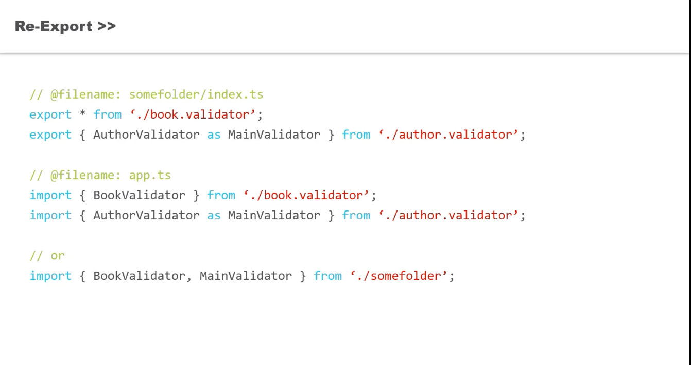
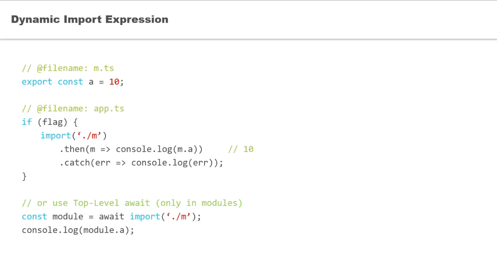

## Modules And Namespaces
- [Defining Namespaces](Defining%20Namespaces.ts)
- [Triple Slash Reference](Triple%20Slash%20Reference.ts)
- [Export Declaration](Export%20Declaration.ts)
- [Export Statement](Export%20Statement.ts)
- [importing from a Module](importing%20from%20a%20Module.ts)
- [Default Export](Default%20Export.ts)
- [Re-Export](Re-Export.ts)
- [Dynamic Import Expression](Dynamic%20Import%20Expression.ts)
- [Type-only imports and exports](Type-only%20imports%20and%20exports.ts)
- [Type Modifiers on Import Names](Type%20Modifiers%20on%20Import%20Names.ts)

## Images
- Modules and Namespaces

- Triple Slash Reference

- Tip Namespace and Interface

- ReExport

- Dynamic Import Expression

- Type Modifiers on Import Names

